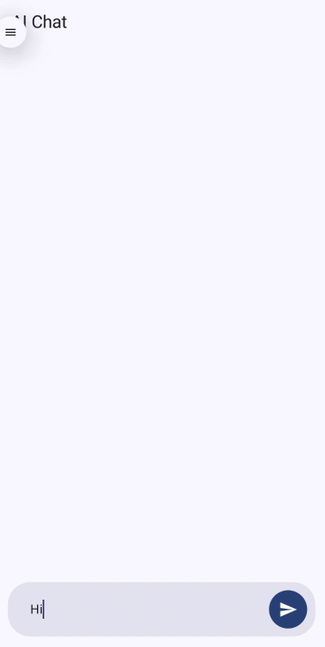

# 🧠 AiChat – Real-Time AI Chat Application (Android)

AiChat is a modern Android application that demonstrates **real-time AI conversation**
using **OpenAI’s streaming APIs**, **Server-Sent Events (SSE)**, and **Jetpack Compose**.

The project is designed to showcase **production-ready AI integration** in Android apps,
with a strong focus on **user experience, scalability, and clean architecture**.

> This project is built as a **portfolio-grade reference implementation** for AI-powered mobile applications.

<p align="center">
  
</p>

📖 **Technical writeup:** [Why Streaming AI Responses Feels Faster Than It Is (Android + SSE)](https://dev.to/shubham_verma_8f24ba13c9b/why-streaming-ai-responses-feels-faster-than-it-is-android-sse-2o6f)

---

## ✨ Key Highlights

- ⚡ Real-time AI response streaming (no waiting for full replies)
- ⌨️ Typewriter-style streaming text effect
- 🧩 Clean MVVM + Clean Architecture
- 🔄 Flow-based streaming pipeline
- 🧪 Error handling
- 🎨 Modern Jetpack Compose UI (Material 3)

---

## 🛠 Tech Stack

- **Language**: Kotlin
- **UI**: Jetpack Compose (Material 3)
- **Architecture**: MVVM + Clean Architecture
- **Async**: Kotlin Coroutines, Flow
- **Dependency Injection**: Hilt
- **Networking**: Retrofit + OkHttp
- **Streaming Protocol**: Server-Sent Events (SSE)
- **AI API**: OpenAI Chat Completion API

---

## 🚀 Getting Started

1. Clone the repository and open it in Android Studio.
2. Add your OpenAI API key to `local.properties`:
   ```
   OPENAI_API_KEY=sk-...
   ```
3. Build and run on a device or emulator (minSdk 24).

> `local.properties` is git-ignored. The key is read by `build.gradle.kts` into `BuildConfig.OPENAI_API_KEY` and injected at runtime via `NetworkModule`.

---

## 📐 Architecture Overview

The application follows **Clean Architecture** principles with a clear separation of concerns.

### Layers

1. **Presentation Layer**
  - Jetpack Compose UI
  - ViewModels for state management

2. **Domain Layer**
  - Business models and interfaces
  - Platform-agnostic logic

3. **Data Layer**
  - Repository implementations
  - Remote API communication

This structure ensures:
- Testability
- Scalability
- Easy replacement of AI providers in the future

---

## 🧩 Key Components

### Application Entry
- **App.kt** – Application class annotated with `@HiltAndroidApp`
- **MainActivity.kt** – Hosts Compose UI and navigation

---

### UI Layer
- **ChatScreen.kt** – Main chat interface built with Compose
- **ChatViewModel.kt** – Manages chat state and streaming logic
- **StreamingTextController.kt** – Controls incremental text rendering

---

### Domain Layer
- **ChatClient.kt** – Interface defining chat streaming contract
- **ChatMessage.kt** – Represents a chat message
- **ChatRequest.kt** – Represents a chat request
- **ChatChunk.kt** – Represents a streamed response chunk

---

### Core / Streaming
- **SseParser.kt** – Parses raw SSE lines into `ChatChunk` objects (`core/streaming/`)

---

### Data Layer
- **ChatRepository.kt** – Coordinates data operations
- **ChatClientImpl.kt** – OpenAI-specific implementation
- **OpenAIApiService.kt** – Retrofit interface
- **OpenAIModels.kt** – DTOs for OpenAI API

---

## 🔁 Data Flow (End-to-End)

### User Input Flow
1. User enters a message in `ChatScreen`
2. User taps **Send**
3. `ChatViewModel.sendMessage()` is invoked
4. A user message is added to UI state
5. `ChatRequest` is created
6. `ChatRepository.streamChat()` is called
7. `ChatClientImpl` initiates a streaming API call
8. OpenAI API returns SSE events

---

### Streaming Response Flow
1. OpenAI sends partial response chunks
2. `SseParser` parses SSE events
3. Each chunk is emitted as a `Flow<ChatChunk>`
4. `ChatViewModel` collects the flow
5. UI state is updated incrementally
6. `StreamingTextController` animates text
7. Final message is committed to chat history

---

## 🌐 Why Server-Sent Events (SSE)?

### Client Perspective (Business Value)

Traditional AI APIs return the **entire response at once**, which causes:

- ❌ Long waiting times
- ❌ Blank screens while users wait
- ❌ Poor perceived performance

**SSE solves this problem.**

### What SSE Enables
- AI responses are streamed **token by token**
- Users see the reply forming in real time
- The app feels fast, responsive, and alive

### Why This Matters for Clients
- 🚀 Better user engagement
- ⏱ Reduced perceived latency
- 💬 Chat feels natural and human-like
- 📈 Higher retention in chat-based apps

> SSE is essential for modern AI products such as ChatGPT-style interfaces, AI assistants,
customer support bots, and productivity tools.

---

## ⌨️ Why StreamingTextController Exists

### The Problem
Streaming APIs emit text **very fast**.  
If rendered directly:

- Text appears in large jumps
- UI feels mechanical and unnatural
- Poor reading experience

---

### The Solution
`StreamingTextController` introduces a **controlled, incremental rendering layer**.

### What It Does
- Buffers incoming text chunks
- Releases characters gradually
- Creates a **typewriter-style effect**
- Keeps UI updates smooth and readable

---

### Why This Is Important
- 🧠 Improves readability
- 🎯 Mimics human typing behavior
- 💡 Enhances perceived intelligence of the AI
- 🧘 Prevents UI jank during fast streams

> This controller separates **network speed** from **visual speed** — a critical UX pattern
for streaming AI applications.

---

## 📌 Conclusion

AiChat demonstrates how to build a **production-ready AI chat experience on Android**
using modern tools and best practices.

It showcases:
- Real-time AI streaming
- Clean, scalable architecture
- UX-first design decisions
- Practical AI integration for real products

This project serves as a **reference implementation** for developers and teams looking
to integrate AI chat capabilities into Android applications.
